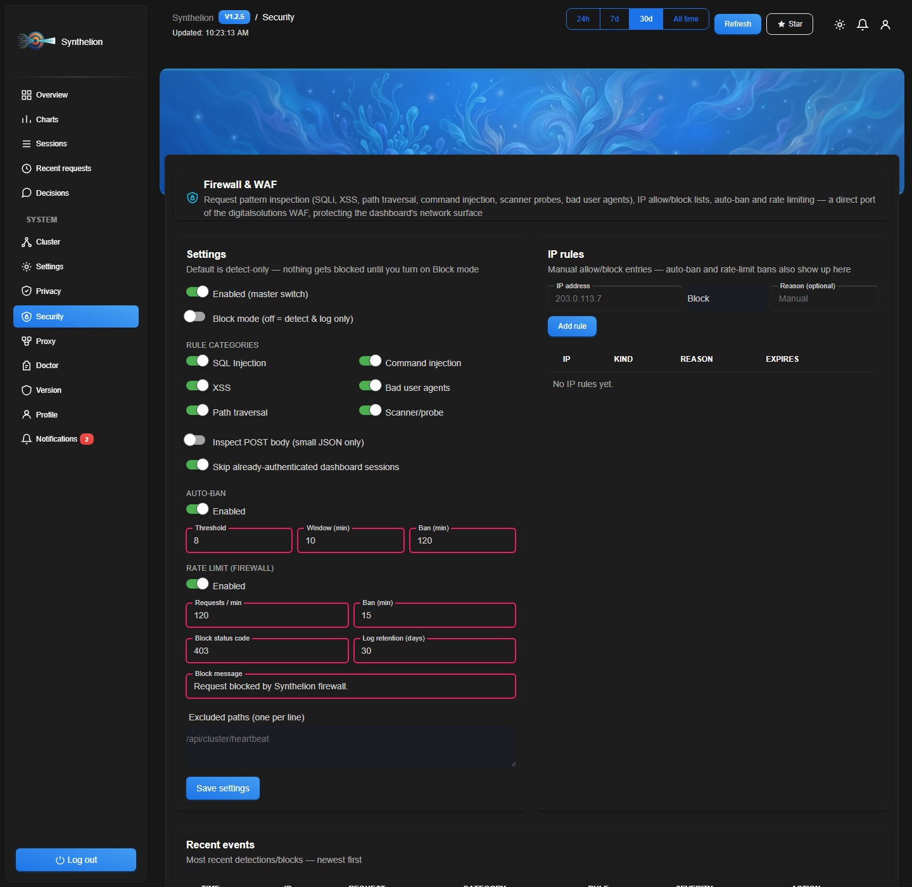
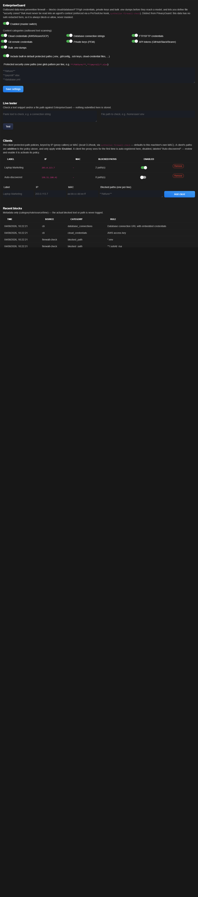

# Synthelion — Universal Token Compressor and Prompt Manager for AI Agents


[](https://pypi.org/project/synthelion/)
[](https://pypi.org/project/synthelion/)
[](https://opensource.org/licenses/MIT)
[](https://github.com/francescopaolopassaro/synthelion/stargazers)
[](https://modelcontextprotocol.io)

Synthelion compresses prompts before they reach any AI model — cutting token usage by up to 70%, reducing API costs, and speeding up responses. It works with **any agent or framework**: Claude Code, OpenAI, LangChain, OpenCode, Cursor, and more.

Supports 50+ languages out of the box. No AI model required. No configuration.

> "Why use many tokens when few tokens do trick?" — A caveman (and your wallet).

<!--
  Demo GIF goes here — record ~5-10s of a terminal running Claude Code: a long
  prompt goes in, the Synthelion hook fires, and "[Synthelion NN% saved]" shows
  up in the systemMessage. Save it as docs/demo.gif and uncomment the line below.
  
-->

---

## Table of contents

- [Why Synthelion?](#why-synthelion)
- [Privacy & Security — PrivacyGuard](#privacy--security--privacyguard)
- [EnterpriseGuard — outbound data-loss-prevention firewall](#enterpriseguard--outbound-data-loss-prevention-firewall)
- [Synthelion vs other prompt/context-compression tools](#synthelion-vs-other-promptcontext-compression-tools)
- [Quick install — one command](#quick-install--one-command)
- [Install (manual)](#install-manual)
- [Update](#update)
- [Set up on Claude Code](#set-up-on-claude-code)
- [Automatic prompt compression — Claude Code hook](#automatic-prompt-compression--claude-code-hook)
- [Using Synthelion with all agents](#using-synthelion-with-all-agents--automatic-compression)
- [Integrations](#integrations) (OpenAI, LangChain, Claude/OpenAI adapters, Python API, CLI)
- [Local proxy — any agent, any provider](#local-proxy--any-agent-any-provider)
- [Web dashboard](#web-dashboard)
- [Cluster deployment](#cluster-deployment)
- [Tools](#tools) (41 MCP tools)
- [Code examples](#code-examples)
- [Compression levels](#compression-levels)
- [Supported languages](#supported-languages-50)
- [Troubleshooting](#troubleshooting)
- [Optional extras](#optional-extras)
- [Contributing](#contributing)
- [Sponsors](#sponsors)
- [Links](#links)

---

## Why Synthelion?

Every token sent to a model costs money and time. Synthelion removes the words that carry no meaning — articles, prepositions, conjunctions, auxiliary verbs — and reduces inflected words to their base form. The model receives exactly the same information, just without the grammatical packaging.

**Strengths:**
- **Zero ML models, zero network calls** — every technique is a deterministic heuristic (curated word lists, BM25, TF-IDF, regex/structural detection). No embedding model to download, nothing phones home.
- **50+ languages out of the box**, no per-language configuration.
- **Content-aware routing** — JSON, HTML, git diffs, logs, code, and prose each get a dedicated compression strategy instead of one generic pass; a universal anti-expansion guard means you never get back something bigger than what you sent in.
- **Adaptive by design** — compression escalates automatically for larger inputs, results are cached by content hash, and repeated tool calls get diffed instead of resent in full.
- **Safety-conscious by default** — credential-shaped text (API keys, tokens, PEM blocks) is redacted before it's ever persisted to disk; destructive-command text is flagged before compression could obscure it.
- **MCP-native** — 41 tools, `readOnlyHint`-annotated where safe for parallel calls, plus first-class OpenAI/LangChain/Claude adapters and a plain Python API.
- **Works even where MCP/hooks don't** — a [local reverse proxy](#local-proxy--any-agent-any-provider) enforces PII masking and compression server-side for any agent that supports a custom API base URL (Cursor, Aider, Codex CLI, Claude Code), with automatic failover across up to 10 backup providers and a circuit breaker, all behind the same firewall that protects the dashboard.
- **Ops-ready** — a local multi-page dashboard, cluster/master-slave deployment, Docker/Kubernetes manifests, all included, none required.

> Beyond every competitor we looked at, we care about security: Synthelion is the
> only library that handles both security and token optimization end-to-end, in
> one package — thanks to years of work on the Caveman C# suite, now available
> here too.

---

## Privacy & Security — PrivacyGuard

A direct Python port of **[Caveman.PrivacyGuard](https://github.com/francescopaolopassaro/Caveman.PrivacyGuard)** (the same C# enterprise PII analyzer used in production Caveman deployments) — not a new, thinner reimplementation, the actual rule set, scoring formula, and ~30 algorithmic checksum validators, unchanged. Same zero-ML philosophy as the rest of Synthelion: every detection is a compiled regex plus, for the categories where it matters, a real checksum algorithm — not just a format guess.

> ⚠️ **Disclaimer**: PrivacyGuard is a technical support tool. It does not replace a Data Protection Impact Assessment (DPIA) or the advice of a DPO (Data Protection Officer). GDPR, AI Act, and NIS2 compliance require contextual legal assessment, a documented legal basis, and organizational processes that no library can substitute for. (Same disclaimer as the original [Caveman.PrivacyGuard](https://github.com/francescopaolopassaro/Caveman.PrivacyGuard) — this is a direct port, so it carries the same limitation.)

- **33 country/region rule sets** (27 EU + UK, Switzerland, China, Russia, Ukraine), **51 detection rules**: email, phone (E.164), IBAN, credit cards, national tax/ID numbers (Italian CF/P.IVA, French NIR, Spanish NIF, Polish PESEL, German Steuer-ID, UK NINO, Swiss AHV, Chinese ID, Russian INN, and 20+ more), GPS coordinates, vehicle plates, JWTs/API secrets, and more.
- **Real checksum validation, not just regex** — an IBAN, a Luhn-valid credit card, an Italian Codice Fiscale, a Polish PESEL, etc. are verified algorithmically, so a random 16-digit number doesn't get flagged as a credit card just because it matches the shape.
- **Compliance-flag mapping** — GDPR, EU AI Act, NIS2, PCI-DSS, and NIST 800-53 flags attached automatically based on what's detected.
- **Session-based masking with recoverable placeholders** — mask PII with `[PG_n]` placeholders before it reaches a model, then restore the originals client-side once the response comes back; the model itself never sees the real data.
- **Prompt-injection guard** — heuristic screening for instruction override, system-prompt exfiltration, role hijack/jailbreak framing, delimiter injection, encoded payloads, and exfiltration coercion, before untrusted text reaches an LLM's context.
- **AI transparency notice** — a ready-to-display, localized (en/it/de/fr/es) "you're talking to an AI" disclosure, supporting EU AI Act Art.50 obligations (confirm applicability/wording with legal counsel).
- **Fully adjustable, on by default** — active on the `compress` hook path from the moment you install Synthelion (so it's not an opt-in a user has to discover), but every piece is a config toggle: turn off masking, the injection guard, or the whole thing entirely with one setting.

```python
from synthelion import PrivacyAnalyzer, PrivacySession

analyzer = PrivacyAnalyzer()
session = PrivacySession()
result = analyzer.analyze(
    "Contact me at mario.rossi@example.it, IBAN IT60X0542811101000000123456",
    session=session, auto_masking=True,
)
print(result.masked_text)
# Contact me at [PG_2], IBAN [PG_1]
print(result.risk_level, result.compliance_flags)

# ... later, once the model's response comes back with the placeholders intact:
print(session.restore(result.masked_text))
# Contact me at mario.rossi@example.it, IBAN IT60X0542811101000000123456
```

Toggle it in `~/.synthelion/config.json` (or the dashboard's Settings → Privacy & Security card):
```json
{
  "privacy": {
    "enabled": true,
    "auto_masking": true,
    "prompt_injection_guard": true,
    "language": "en",
    "ai_transparency_notice": false
  }
}
```
Setting `"enabled": false` restores exactly the pre-1.2.2 behavior — no privacy pre-pass at all.

### Before / After

**English prose** — 20 tokens → 9 tokens (−55%)
```
Before: I would like to know if it is possible to receive information about
        cheap restaurants in Rome, please.

After:  like know possible receive information about cheap restaurant Rome
```

**Italian prose** — 16 tokens → 9 tokens (−44%)
```
Before: Vorrei sapere se è possibile ricevere informazioni sui ristoranti
        economici a Roma, per favore.

After:  sapere è possibile ricevere informazione ristorante economico Roma favore
```

**JSON array** — 256 tokens → 80 tokens (−69%)
```json
// Before: full JSON with repeated keys on every object
[{"name":"Alice","age":30,"city":"Rome"},{"name":"Bob","age":25,"city":"Milan"},…]

// After: lossless markdown table
| name  | age | city  |
| ----- | --- | ----- |
| Alice | 30  | Rome  |
| Bob   | 25  | Milan |
```

**HTML page** — 192 tokens → 58 tokens (−70%)
```
// Before: full HTML with tags, attributes, scripts
<html><head>…</head><body><div class="…"><p>Visit Rome today…</p></div></body></html>

// After: clean extracted text, then NLP-compressed
Visit Rome today enjoy ancient history food culture
```

---

### Benchmark — token savings by content type

Measured with `synthelion`'s own token counter against real inputs — reproduce
with `synthelion bench --json` (content router) or `CompressionService.compress`
directly (NLP-only, per-level).

#### NLP compression (prose, per level)

| Content | Original tokens | Light | Semantic | Aggressive |
|:---|---:|:---:|:---:|:---:|
| Prose EN | 20 | −55.0% | −55.0% | **−75.0%** |
| Prose IT | 16 | −43.8% | −43.8% | **−62.5%** |
| Prose DE | 19 | −47.4% | −47.4% | **−63.2%** |
| Prose FR | 18 | −38.9% | −38.9% | **−55.6%** |
| Prose ES | 17 | −47.1% | −47.1% | −52.9% |

#### Content router (`synthelion bench --json`, auto-selects the best strategy)

| Content | Original | After | Saved |
|:---|---:|---:|:---:|
| Plain text EN | 196 | 105 | −46.4% |
| Plain text IT | 200 | 131 | −34.5% |
| JSON array (20 rows) | 609 | 326 | −46.5% |
| Git diff (2 files) | 328 | 198 | −39.6% |
| Python code | 273 | 152 | −44.3% |
| Log / stacktrace (retry burst) | 1,666 | 102 | **−93.9%** |
| HTML page | 242 | 63 | **−74.0%** |
| Tool-schema JSON (new in 1.2.2 — `ToolSignature`) | 315 | 106 | **−66.3%** |
| Nested JSON object (new in 1.2.2 — `ChainCollapse`) | 32 | 24 | −25.0% |

Larger, more realistic payloads compress further than tiny samples — the log
benchmark above is a 20-repeat retry burst (a real flaky-dependency scenario),
where `LogCompressor`'s dedup collapses near-identical stack traces down to
one occurrence plus a counter.

---

#### Global IDF-aware compression & summarization (56 languages)

`synthelion/global_idf_provider.py` ships a precomputed, per-language global
document-frequency table (built offline from Wikipedia,
`devtools/build_idf_corpus_wikipedia.ps1`, ~127 MB total across 56 languages in
`synthelion/worddata/`) and blends it 50/50 with the existing local (single-
prompt) IDF wherever Synthelion scores word/sentence importance statistically.
**Wired into production as of this writing**: the `compress` command's
`statistical` level (`synthelion/core.py`'s `_filter_statistical`) and the
`summarize` command's `tfidf` algorithm (`TfIdfSummarizer`) — both the CLI,
the MCP/OpenAI-function tools, and the local reverse proxy (`synthelion serve-proxy`)
now construct these with `global_idf=GlobalIdfProvider()` by default. The
Claude Code hook goes through the same `compress` CLI path, so it benefits
automatically. Other compression levels (`light`/`semantic`/`aggressive`/
`syntactic`) are pure token-filter/lemma logic with no frequency scoring, so
global IDF doesn't apply to them.

**Compression level `statistical` — extra tokens dropped, global vs local-only IDF**
(15 real Wikipedia paragraphs per language, same content both runs):

| Lang | Local-only | +Global | Δ | Lang | Local-only | +Global | Δ | Lang | Local-only | +Global | Δ |
|:---|---:|---:|---:|:---|---:|---:|---:|:---|---:|---:|---:|
| af | 45.5% | 58.6% | +13.2pp | he | 32.4% | 61.7% | +29.4pp | pl | 43.2% | 63.0% | +19.7pp |
| ar | 15.7% | 42.4% | +26.7pp | hi | 46.9% | 48.3% | +1.4pp | pt | 40.0% | 62.4% | +22.4pp |
| be | 36.7% | 57.1% | +20.4pp | hr | 41.2% | 61.8% | +20.6pp | ro | 41.7% | 58.5% | +16.9pp |
| bg | 30.6% | 48.2% | +17.5pp | hu | 42.1% | 64.6% | +22.5pp | ru | 20.8% | 46.1% | +25.4pp |
| bn | 37.4% | 39.2% | +1.8pp | hy | 22.0% | 45.5% | +23.6pp | sk | 40.7% | 60.7% | +20.1pp |
| ca | 49.8% | 63.9% | +14.2pp | id | 51.6% | 65.8% | +14.3pp | sl | 45.7% | 65.2% | +19.4pp |
| cs | 37.1% | 58.0% | +21.0pp | is | 38.7% | 58.8% | +20.1pp | sq | 32.0% | 54.6% | +22.6pp |
| da | 47.4% | 62.8% | +15.4pp | it | 47.7% | 65.3% | +17.6pp | sr | 27.4% | 49.7% | +22.3pp |
| de | 43.7% | 64.3% | +20.5pp | ja | 43.7% | 48.5% | +4.7pp | sv | 48.4% | 65.7% | +17.3pp |
| el | 15.1% | 46.9% | +31.8pp | kk | 28.4% | 53.3% | +24.9pp | ta | 28.0% | 31.3% | +3.3pp |
| en | 50.5% | 67.3% | +16.8pp | kn | 28.5% | 29.7% | +1.2pp | te | 26.3% | 27.2% | +0.9pp |
| es | 50.9% | 66.7% | +15.7pp | ko | 19.8% | 49.8% | +30.0pp | th | 14.3% | 19.6% | +5.3pp |
| et | 37.0% | 59.7% | +22.7pp | la | 46.7% | 60.5% | +13.8pp | tr | 38.3% | 49.0% | +10.7pp |
| eu | 46.5% | 66.3% | +19.8pp | lt | 38.6% | 58.2% | +19.6pp | uk | 36.5% | 59.1% | +22.6pp |
| fa | 14.4% | 42.3% | +28.0pp | lv | 35.0% | 60.4% | +25.4pp | ur | 28.4% | 52.5% | +24.1pp |
| fi | 35.8% | 49.0% | +13.2pp | mk | 44.9% | 64.5% | +19.6pp | vi | 32.5% | 49.2% | +16.7pp |
| fr | 42.4% | 60.6% | +18.3pp | mr | 34.9% | 38.2% | +3.3pp | zh | 38.9% | 40.6% | +1.7pp |
| ga | 46.7% | 61.2% | +14.5pp | ms | 48.2% | 58.8% | +10.6pp | | | | |
| gl | 48.9% | 69.6% | +20.7pp | nl | 43.7% | 62.7% | +18.9pp | | | | |
| no | 46.3% | 57.4% | +11.1pp | | | | | | | | |

**Aggregate: 37.4% → 54.5% average tokens dropped (+17.1pp)** — the global
reference consistently lets `statistical` recognize more true filler/generic
words per language than a single prompt's own local frequencies can, without
any empty-output regressions (0 empty results across all 56 × 15 samples —
the existing per-sentence safety floor holds). Larger gains cluster in
languages whose local-only baseline was weakest (`el`, `fa`, `ar`, `ko`, `he`,
`ru` all gained 25pp+) — global grounding helps most exactly where a single
short prompt has too little internal repetition for local IDF to work well.

**Quality check (not just a shorter output — still on-topic):** spot-checked
English/Italian/French/Spanish/German samples by reading them directly.
Example (English, ratio unrelated — `statistical` keeps content words, not
full sentences):
> local-only: *"trace anarchist idea throughout history modern anarchism
> emerge Enlightenment latter half 19th decade 20th century anarchist
> movement flourish parts significant role worker struggle..."*
> +global: *"trace anarchist anarchism emerge Enlightenment 19th decade 20th
> century anarchist movement flourish worker struggle forget emancipation
> anarchist anarchists Paris Commune Russian Civil War Spanish Civil War..."*

The global-blended version drops generic connective filler (`half`, `latter`,
`parts`) that the local-only run kept, while holding on to the repeated
domain terms (`anarchist`/`anarchism`/`movement`) — a real, correctly-directed
quality shift, not just more aggressive truncation.

---

#### `TfIdfSummarizer` (extractive `summarize`, `tfidf` algorithm)

Since the sentence *budget* (`ratio`/`sentence_count`) is fixed regardless of
scoring, output length barely moves — the metric that actually shows the
global table's effect is **which sentences get selected**. Measured on 12
real Wikipedia articles per language (ratio 0.3), comparing local-only vs
local+global blended scoring:

| Lang | Selected-sentence overlap | Lang | Selected-sentence overlap | Lang | Selected-sentence overlap |
|:---|---:|:---|---:|:---|---:|
| af | 64.1% | he | 57.3% | pl | 58.5% |
| ar | 79.1% | hi | 83.3% | pt | 78.6% |
| be | 62.9% | hr | 67.5% | ro | 66.9% |
| bg | 73.2% | hu | 72.8% | ru | 64.0% |
| bn | 100.0%* | hy | 100.0%* | sk | 60.0% |
| ca | 79.9% | id | 70.3% | sl | 67.1% |
| cs | 68.0% | is | 70.9% | sq | 74.7% |
| da | 63.9% | it | 70.3% | sr | 73.5% |
| de | 100.0%* | ja | 97.8% | sv | 80.4% |
| el | 80.5% | kk | 69.2% | ta | 68.3% |
| en | 62.8% | kn | 57.7% | te | 55.2% |
| es | 73.3% | ko | 61.1% | th | 83.3% |
| et | 56.9% | la | 65.2% | tr | 74.7% |
| eu | 66.5% | lt | 71.9% | uk | 72.2% |
| fa | 69.8% | lv | 66.5% | ur | 100.0%* |
| fi | 70.5% | mk | 77.2% | vi | 61.1% |
| fr | 55.4% | mr | 68.7% | zh | 83.1% |
| ga | 70.3% | ms | 64.5% | | |
| gl | 75.3% | nl | 53.7% | | |
| no | 58.0% | | | | |

**Aggregate: 71.4% average sentence overlap across all 56 languages** — meaning
on average **~29% of selected sentences change** when the global table is
blended in, i.e. the global signal has a real, non-trivial effect on which
content gets kept. `*` — af/bn/de/hy/ur showed 0% change on this specific
sample because the sample documents were short enough to fall below the
sentence-budget threshold (both variants returned the full text unchanged),
not because the global table has no effect for those languages.

Per-language `.idf.br` tables live in `synthelion/worddata/` (built from each
language's Wikipedia `pages-articles-multistream1` shard, ~127 MB total across
all 56 languages, shipped in the base package).

#### `aggressive` compression level — also global-IDF-aware (56 languages)

`_filter_aggressive` now additionally drops a word when the global table says
it appears in **more than 50% of the entire reference corpus's documents** for
that language — i.e. it's functionally generic even though the hand-curated
`fw`/`generic` word lists missed it (those lists can't be exhaustive). The
threshold is deliberately conservative: a past incident (see `_EN_ADV`/`_EN_ADJ`
history in `core.py`) already showed that being too aggressive about "this is
just filler" silently drops real content (a sentence's main verb, or a
domain-specifying adjective like "financial" in "quarterly financial report").
`light`/`semantic`/`syntactic` are untouched — `semantic` in particular is
meant to stay closest to lossless, and `syntactic`'s grammatical-glue logic
doesn't have an equivalent single-word drop point to extend safely.

| Lang | Local-only | +Global | Δ | Lang | Local-only | +Global | Δ | Lang | Local-only | +Global | Δ |
|:---|---:|---:|---:|:---|---:|---:|---:|:---|---:|---:|---:|
| af | 49.8% | 49.8% | +0.0pp | he | 33.2% | 33.2% | +0.0pp | pl | 43.6% | 43.6% | +0.0pp |
| ar | 16.0% | 19.9% | +3.9pp | hi | 52.4% | 52.4% | +0.0pp | pt | 44.1% | 44.1% | +0.0pp |
| be | 39.0% | 39.0% | +0.0pp | hr | 41.8% | 41.8% | +0.0pp | ro | 42.2% | 42.2% | +0.0pp |
| bg | 36.1% | 39.2% | +3.1pp | hu | 42.1% | 42.1% | +0.0pp | ru | 33.1% | 33.1% | +0.0pp |
| bn | 38.2% | 38.2% | +0.0pp | hy | 31.1% | 31.1% | +0.0pp | sk | 40.2% | 40.2% | +0.0pp |
| ca | 49.9% | 49.9% | +0.0pp | id | 53.1% | 53.1% | +0.0pp | sl | 48.2% | 48.2% | +0.0pp |
| cs | 37.3% | 37.3% | +0.0pp | is | 44.2% | 44.2% | +0.0pp | sq | 32.3% | 40.7% | +8.4pp |
| da | 52.1% | 52.1% | +0.0pp | it | 53.5% | 53.5% | +0.0pp | sr | 33.5% | 33.5% | +0.0pp |
| de | 47.3% | 47.3% | +0.0pp | ja | 88.5% | 88.5% | +0.0pp | sv | 50.5% | 50.5% | +0.0pp |
| el | 18.7% | 18.7% | +0.0pp | kk | 31.0% | 31.0% | +0.0pp | ta | 28.6% | 28.6% | +0.0pp |
| en | 56.7% | 56.7% | +0.0pp | kn | 28.6% | 28.6% | +0.0pp | te | 28.3% | 28.3% | +0.0pp |
| es | 53.5% | 53.5% | +0.0pp | ko | 25.0% | 25.0% | +0.0pp | th | 22.1% | 22.1% | +0.0pp |
| et | 37.3% | 37.3% | +0.0pp | la | 49.1% | 49.1% | +0.0pp | tr | 37.8% | 37.8% | +0.0pp |
| eu | 48.3% | 48.3% | +0.0pp | lt | 40.7% | 40.7% | +0.0pp | uk | 51.1% | 51.1% | +0.0pp |
| fa | 18.1% | 18.1% | +0.0pp | lv | 35.5% | 35.5% | +0.0pp | ur | 28.6% | 28.6% | +0.0pp |
| fi | 36.1% | 36.1% | +0.0pp | mk | 47.6% | 47.6% | +0.0pp | vi | 33.5% | 33.5% | +0.0pp |
| fr | 47.0% | 47.0% | +0.0pp | mr | 36.8% | 36.8% | +0.0pp | zh | 90.1% | 90.1% | +0.0pp |
| ga | 50.5% | 50.5% | +0.0pp | ms | 48.2% | 48.2% | +0.0pp | | | | |
| gl | 51.3% | 51.3% | +0.0pp | nl | 49.5% | 49.5% | +0.0pp | | | | |
| no | 49.2% | 49.2% | +0.0pp | | | | | | | | |

**Aggregate: 42.00% → 42.27% (+0.27pp)** — much smaller than `statistical`'s
+17.1pp, and that's the honest, expected result: `aggressive`'s hand-curated
`generic`/`fw` word lists already catch nearly every truly-ubiquitous word for
most languages, so the new global-ubiquity check rarely finds anything new to
drop. Only `ar`/`bg`/`sq` showed a real effect on this sample, meaning their
curated generic-word lists have gaps the global reference happened to catch —
useful as a small safety net, not a major lever, for this level. Zero
empty-output regressions across all 56 × 15 samples (the existing "never
empty a non-empty sentence" fallback holds under the new drop condition too —
covered by `TestCompressionServiceGlobalIdf` in `tests/test_synthelion.py`).

#### Data source, license & operational notes

- **Source & attribution**: the `.idf.br` tables are derived from [Wikipedia](https://www.wikipedia.org/)
  dumps (`https://dumps.wikimedia.org/`), each language's `pages-articles-multistream1`
  shard. Wikipedia's text content is licensed [CC BY-SA 4.0](https://creativecommons.org/licenses/by-sa/4.0/)
  (and GFDL); what Synthelion ships is a derived **aggregate statistic** — a
  `word → document-frequency count` table, not article text or any reproduction
  of the original prose — but the source is credited here regardless, per the
  Wikimedia Foundation's trademark/attribution expectations for reuse.
- **Corpus limitation — not a random sample**: `multistream1` is the *first*
  page-id shard of each wiki, not a random cross-section of the whole
  encyclopedia. For large wikis (en/fr/de/...) that's still hundreds of
  thousands of real articles, but it systematically skews toward
  earlier-created/earlier-indexed topics rather than the wiki's full breadth.
  Good enough to meaningfully outperform local-only IDF (see benchmarks
  above), not a claim of a statistically neutral reference corpus.
- **No freshness/versioning yet**: the tables are a one-time snapshot (built
  2026-08-03/04). There's no metadata recording the build date inside the
  `.idf.br` file itself and no automatic refresh — rebuilding is a manual
  `devtools/build_idf_corpus_wikipedia.ps1` run (per-language, skips a
  language whose table already exists unless `-Force`).
- **Lazy loading is the intentional default, not an oversight**: each
  language's table is decompressed and parsed into memory only on first use,
  then cached for the process lifetime (`GlobalIdfProvider`, a thread-safe
  class-level cache). Measured cost: ~0.01 ms for a cached lookup, but
  **up to ~700 ms the first time a specific language is used** (largest
  table: Bulgarian, 2.68M reference documents / 1.14M terms). We measured
  eagerly preloading **all 56 languages** at process startup — 44.7 seconds
  and tens of millions of live dict entries in memory — and rejected that as
  the default; it would trade a rare per-language latency blip for a
  guaranteed, large, permanent memory/startup cost paid by every process
  regardless of which languages it actually serves. `GlobalIdfProvider.preload(["eng", "ita"])`
  is available for operators who know in advance which specific languages a
  long-running deployment (proxy, dashboard) will actually serve and want to
  warm just those ahead of the first request.

---

### Synthelion vs other prompt/context-compression tools

A capability comparison, not a performance benchmark — we don't publish
head-to-head token-savings numbers against other projects because we haven't
run their code in a controlled, reproducible setup; this table is based on
reading each project's public source. If you've measured a real head-to-head,
open an issue with your methodology and we'll link it here.

| Capability | Synthelion | headroom | kompact | tokenless | squeez | bu-ketao |
|:---|:---:|:---:|:---:|:---:|:---:|:---:|
| Zero ML models, zero network calls | ✅ | ❌ (torch/transformers/SigLIP, fine-tuned classifiers) | ✅ | ⚠️ optional ONNX embedding | ✅ | n/a (prompt rules, no code) |
| NLP compression, 50+ languages | ✅ | — (ML feature extraction instead) | ✅ (TF-IDF) | — | — | n/a |
| Content-type auto-routing (JSON/HTML/diff/log/code) | ✅ | ✅ | ✅ | ✅ (shape-based) | — | n/a |
| Tool-schema → compact signature | ✅ | — | ✅ (TF-IDF selection) | ✅ | — | n/a |
| Credential-shape detection before persisting | ✅ | — | — | — | ✅ (origin) | n/a |
| Terminal ANSI/noise cleanup + success collapse | ✅ | — | — | — | ✅ (origin) | n/a |
| Masking old tool output + retrieval (Artifact Index) | ✅ | — | ✅ (origin) | — | — | n/a |
| Diff-on-repeat for identical tool calls | ✅ | — | — | — | — | n/a |
| Adaptive compression scaling by content size | ✅ | — | ✅ (origin) | — | — | n/a |
| JSON chain-depth / dot-path collapsing | ✅ | — | — | ✅ (origin) | — | n/a |
| Advisory command-rewrite (never executes) | ✅ | — | — | ⚠️ executes it (rtk wrapper) | — | n/a |
| Local multi-page web dashboard | ✅ | ✅ | ✅ (simpler) | — | — | n/a |
| Cluster / master-slave deployment | ✅ | — | — | — | — | n/a |
| MCP protocol (Claude Code, etc.) | ✅ 41 tools | ✅ (CLI plugins: Claude/Codex/Gemini) | — (HTTP proxy instead) | ✅ (hooks) | — | n/a |
| Vision/image token optimization | — (text-only) | ✅ (tile-aligned resize + trained router) | — | — | — | n/a |
| Provider cache-breakpoint-aware read staleness | ✅ | ✅ (origin, `read_maturation.py`) | — | — | — | n/a |
| Response-style compression (output-side, CJK-aware) | ✅ | — | — | — | — | ✅ (origin) |
| PII detection + masking (33 countries, GDPR/AI Act compliance) | ✅ | — | — | — | — | — |
| Prompt-injection guard (jailbreak/instruction-override screening) | ✅ | — | — | — | — | — |
| Local reverse proxy (any agent, any provider, schema-agnostic) | ✅ | ✅ (origin, `headroom proxy`) | ✅ (proxy instead of MCP) | — | — | n/a |
| Proxy: automatic failover across backup providers (up to 10) | ✅ | — (not found in public docs) | — | — | — | n/a |
| Proxy: circuit breaker on repeated rate-limit/5xx | ✅ | — (not found in public docs) | — | — | — | n/a |
| Proxy: WAF/firewall protecting the proxy surface itself | ✅ | — | — | — | — | n/a |
| Proxy: enforced block-on-risk (request never reaches the provider) | ✅ | — | — | — | — | n/a |
| Proxy request log is metadata-only — no prompt/response ever stored | ✅ | — (stores content when `--log-messages` is on) | — | — | — | n/a |

**Not in this table:** `tokensave` — a Rust code-intelligence tool (Tree-sitter knowledge graph, dead-code/cycle detection, code-health scoring) that solves a genuinely different problem (structural understanding of a codebase) rather than context/token compression, so it isn't a like-for-like comparison here.

**On headroom specifically:** the broadest-scope alternative we looked at — proxy architecture, persistent memory, vision-token optimization, and ML-based response-length prediction (fine-tuned MiniLM/SigLIP classifiers hosted on HuggingFace). That breadth comes at the cost of the zero-ML-models guarantee Synthelion makes: several of headroom's key decisions (image routing, response-length prediction) depend on downloaded, trained models rather than deterministic heuristics. Synthelion's proxy (new, see [below](#local-proxy--any-agent-any-provider)) closes the "does it actually work with any agent" gap headroom's proxy opened, and adds three things we didn't find in headroom's public docs: automatic failover across up to 10 backup providers when one doesn't respond, a circuit breaker that stops hammering an already-rate-limited upstream, and a firewall (WAF) protecting the proxy's own network surface — on a strictly metadata-only request log (duration, status, tokens saved; never the prompt or response body).

---

### What this means for your costs

Token pricing varies by model. As a rough example with GPT-4o ($2.50 / 1M input tokens):

| Daily input volume | Without Synthelion | With Synthelion (40% avg savings) | Annual saving |
|:---|---:|---:|---:|
| 500K tokens/day | $456/year | $274/year | **$182/year** |
| 2M tokens/day | $1,825/year | $1,095/year | **$730/year** |
| 10M tokens/day | $9,125/year | $5,475/year | **$3,650/year** |

Savings scale with volume. For agent loops that send the same context on every call, real savings are often higher than the 40% average.

### Energy & sustainability

Synthelion includes a built-in energy estimator. Every saved token avoids approximately **0.005 mWh** of compute energy and **0.002 mg CO₂**. At scale, that adds up.

```python
result = svc.compress(long_prompt, CompressionLevel.SEMANTIC)
print(f"Energy saved: {result.estimated_energy_saved_mwh:.3f} mWh")
print(f"CO₂ avoided:  {result.estimated_co2_saved_mg:.3f} mg")
```

---

## EnterpriseGuard — outbound data-loss-prevention firewall

A **hard block-or-allow firewall**, distinct from PrivacyGuard (PII, masked-and-continue) and the WAF (inbound HTTP request inspection). EnterpriseGuard is for enterprise secrets/credentials that have **no safe redacted form** — cloud/database/FTP/git credentials, private keys, bulk `.env` dumps — plus user-defined file "security zones" that must never be read into an agent's context at all.

- **Content scanning** — AWS/Azure/GCP credentials, PostgreSQL/MySQL/MongoDB/JDBC/ADO.NET connection strings, FTP/SFTP URLs with embedded credentials, git remote URLs with embedded credentials, PEM private key blocks, GitHub/Slack/Bearer tokens, bulk `.env`-style dumps — always **block**, never mask (unlike PII, there's no safe redacted form of a live secret).
- **File "security zones"** — user-defined glob patterns (`**/fatture/**`, `**/payroll/*.xlsx`, `**/database.yml`, ...) an agent must never be allowed to read, enforced *before* the read happens via `synthelion firewall-check` — a `PreToolUse`-style hook you point Claude Code (or any agent hook that supports pre-tool vetoes) at. Ships with sensible defaults already blocked (`.env`, `.git/config`, SSH/PEM keys, cloud-credential files, `.npmrc`/`.pypirc`/`.netrc`, kubeconfig).
- **SSRF / cloud-metadata egress** — a fetch/webhook URL argument or Bash command targeting a cloud metadata endpoint (`169.254.169.254`, GCP/Azure metadata hosts, ...), a loopback/RFC1918 private address, or a dangerous non-HTTP scheme (`file://`, `gopher://`, `dict://`) is vetoed the same way a blocked file path is — scoped to the tool call itself (`check_tool_call`), so a prompt that merely *discusses* an internal URL is never blocked, only a tool actually invoked with one.
- **Destructive-shell commands** — a Bash-shaped tool call matching a destructive pattern (`rm -rf`, `drop table`, `git push --force`, ...) is blocked outright at the same `check_tool_call` gate, not just flagged advisory like `SafetyGuard`'s compression-skip.
- **Wired into every entry point**: CLI (`compress`), the Claude Code hook (goes through the CLI, no separate wiring needed), MCP/OpenAI-function tools (`compress`, plus an advisory `check_enterprise_guard` tool), and the local reverse proxy — the same posture as PrivacyGuard's `block_on_risk`.
- **Per-client policies (IP/MAC), because Synthelion is a shared server, not a single-user tool.** A `blocked_paths` list isn't global-only: register a client by **IP** (the proxy sees the real connecting IP per request) or **MAC** (`synthelion firewall-check` defaults to *this machine's own MAC* — the natural identity for a local CLI/hook invocation) and give it its own additional protected paths. The proxy **auto-discovers** a never-before-seen client IP on its first request and registers it **disabled** — it shows up in the dashboard for an admin to label/configure/enable, never silently trusted or silently restricted before a human looks at it. Manage clients from the dashboard's Security page or `synthelion clients list/add/update/remove`.
- **Audit log, not a data store**: a cross-process JSONL log (visible in the dashboard, survives regardless of which process — CLI/MCP/proxy — did the blocking) records only `category`/`rule_name`/`source`/`timestamp` for every block — **never** the triggering text or path, so the log itself can never become a place a secret ends up persisted.

```bash
# One-off check (advisory)
synthelion firewall-check --tool Read --args '{"file_path": "/home/user/.env"}'
# BLOCK: Blocked: '/home/user/.env' matches a protected security-zone pattern ('*.env').

# SSRF-shaped fetch target — blocked the same way
synthelion firewall-check --tool WebFetch --args '{"url": "http://169.254.169.254/latest/meta-data/"}'
# BLOCK: Blocked: 'url' targets an SSRF-shaped destination (cloud-metadata-endpoint).

# Destructive shell command — blocked the same way
synthelion firewall-check --tool Bash --args '{"command": "rm -rf /"}'
# BLOCK: Blocked: command matches a destructive-shell pattern ('rm -rf').

# Register a proxy client with its own extra protected paths
synthelion clients add --label "Marketing laptop" --ip 203.0.113.7 \
  --blocked-path "**/fatture/**" --blocked-path "**/payroll/*.xlsx"

synthelion clients list
```

Wire `firewall-check` as a Claude Code `PreToolUse` hook (`.claude/settings.json`) to actually veto `Read`/`Bash`/`Grep` calls before they execute:
```json
{
  "hooks": {
    "PreToolUse": [{
      "matcher": "Read|Bash|Grep|Glob",
      "hooks": [{
        "type": "command",
        "command": "synthelion firewall-check --tool \"$CLAUDE_TOOL_NAME\" --args \"$CLAUDE_TOOL_INPUT\""
      }]
    }]
  }
}
```

Toggle/configure it in `~/.synthelion/config.json` (or the dashboard's Security page):
```json
{
  "enterprise_guard": {
    "enabled": true,
    "content_categories": {
      "cloud_credentials": true, "database_connections": true, "ftp_credentials": true,
            "git_credentials": true, "private_keys": true, "api_tokens": true, "dotenv_bulk": true,
      "ssrf_egress": true, "destructive_commands": true
    },
    "blocked_paths": [],
    "use_default_blocked_paths": true,
    "auto_discover_clients": true
  }
}
```

---

## Quick install — one command

> The fastest way: download one script and run it. It installs Synthelion, detects your Python path, configures Claude Code MCP, and sets up the auto-compression hook automatically.

### Windows (PowerShell)

```powershell
# Download and run
Invoke-WebRequest https://raw.githubusercontent.com/francescopaolopassaro/synthelion/main/install_claude.ps1 -OutFile install_claude.ps1
powershell -ExecutionPolicy Bypass -File install_claude.ps1
```

Or, if you already cloned the repo:
```powershell
powershell -ExecutionPolicy Bypass -File install_claude.ps1
```

### Linux / macOS (bash)

```bash
curl -fsSL https://raw.githubusercontent.com/francescopaolopassaro/synthelion/main/install_claude.sh | bash
# or, after cloning the repo:
chmod +x install_claude.sh && ./install_claude.sh
```

### All platforms (Python — works everywhere)

```bash
python install_claude.py
```

### Installer options

**Windows PowerShell (`install_claude.ps1`)**

| Flag | Description |
|---|---|
| `-Upgrade` | Update Synthelion to the latest version |
| `-NoHook` | Skip the auto-compression hook |
| `-NoPip` | Skip pip install (Synthelion already installed) |
| `-Uninstall` | Remove Synthelion and all Claude Code config |

```powershell
powershell -ExecutionPolicy Bypass -File install_claude.ps1 -Upgrade     # update
powershell -ExecutionPolicy Bypass -File install_claude.ps1 -Uninstall   # remove everything
powershell -ExecutionPolicy Bypass -File install_claude.ps1 -NoPip -NoHook  # only update settings.json
```

**Linux / macOS (`install_claude.sh`) and Python (`install_claude.py`)**

| Flag | Description |
|---|---|
| `--upgrade` | Update Synthelion to the latest version |
| `--no-hook` | Skip the auto-compression hook |
| `--no-pip` | Skip pip install (Synthelion already installed) |
| `--uninstall` | Remove Synthelion and all Claude Code config |

```bash
python install_claude.py --upgrade          # update
python install_claude.py --uninstall        # remove everything
python install_claude.py --no-pip --no-hook # only update settings.json
```

---

## Install (manual)

**Requirements:** Python 3.11+ — download from [python.org](https://www.python.org/downloads/) and tick "Add to PATH" during setup.

```powershell
# 1. Install Synthelion
pip install synthelion

# 2. Verify the CLI works
synthelion compress --text "Hello world, how are you today?" --json

# 3. Verify the MCP server starts (Ctrl+C to stop)
synthelion-mcp
```

If `synthelion` is not recognised after install, close and reopen the terminal (PATH refresh needed).

---

### Linux

```bash
# 1. Install Synthelion
pip install synthelion
# or, in a virtualenv:
python3 -m venv ~/.venvs/synthelion
source ~/.venvs/synthelion/bin/activate
pip install synthelion

# 2. Verify
synthelion compress --text "Hello world, how are you today?" --json

# 3. If synthelion-mcp is not in PATH (virtualenv scenario), add it:
# Add the venv's bin directory to ~/.bashrc or use the absolute path in MCP config
echo 'export PATH="$HOME/.venvs/synthelion/bin:$PATH"' >> ~/.bashrc
source ~/.bashrc
```

---

### macOS

```bash
# 1. Install with pip (system Python or Homebrew Python)
pip3 install synthelion
# or with uv (recommended — no PATH issues):
pip install uv
uvx synthelion-mcp   # runs the MCP server without a permanent install

# 2. Verify
synthelion compress --text "Hello world, how are you today?" --json
```

---

### Zero-install with uvx (all platforms)

[uv](https://docs.astral.sh/uv/) installs and runs Synthelion in an isolated environment — no `pip install` needed:

```bash
pip install uv       # one-time
uvx synthelion-mcp   # starts the MCP server directly
```

---

## Update

### Windows

```powershell
pip install --upgrade synthelion

# Verify new version
synthelion --version
```

### Linux / macOS

```bash
pip install --upgrade synthelion
# or, if installed in a virtualenv:
source ~/.venvs/synthelion/bin/activate
pip install --upgrade synthelion
```

### With uv / uvx

uvx always fetches the latest version automatically — nothing to do.

---

## Set up on Claude Code

Claude Code uses the MCP protocol to talk to Synthelion.

### Step 1 — Install Synthelion (see above)

### Step 2 — Register with one command (new in 1.0.7)

```bash
synthelion install           # writes to ~/.claude.json (global)
synthelion install --local   # writes to .claude/settings.json (project-only)
```

Or manually:

### Step 2 (manual) — Add to `~/.claude/settings.json`

Open the file (`%USERPROFILE%\.claude\settings.json` on Windows, `~/.claude/settings.json` on Linux/macOS) and add:

```json
{
  "mcpServers": {
    "synthelion": {
      "command": "synthelion-mcp"
    }
  }
}
```

If `synthelion-mcp` is not in PATH (virtualenv, macOS Homebrew Python), use the absolute path:

```json
{
  "mcpServers": {
    "synthelion": {
      "command": "/home/user/.venvs/synthelion/bin/synthelion-mcp"
    }
  }
}
```

Or use uvx — it always works without PATH issues:

```json
{
  "mcpServers": {
    "synthelion": {
      "command": "uvx",
      "args": ["synthelion-mcp"]
    }
  }
}
```

### Step 3 — Restart Claude Code

Close and reopen the Claude Code window (or run `claude` again in the terminal). Synthelion is now available as an MCP tool.

### Step 4 — Verify

Type in Claude Code:
> *"Use Synthelion to compress this: I would like to know if it is possible to receive information about cheap restaurants in Rome."*

Claude will call the MCP tool and return the compressed version.

---

## Automatic prompt compression — Claude Code hook

> **How it works:** every prompt is automatically scanned and compressed by Synthelion (no minimum length — PrivacyGuard's PII masking runs on short prompts too, since that's often where a single pasted secret or IBAN shows up). The compressed text is injected as `additionalContext` for Claude (invisible in the terminal — that's the part that actually does the token-saving work), while a `systemMessage` — `[Synthelion N% saved - X mWh - Y mg CO2 saved]` — is shown visibly so you can confirm it fired. When PrivacyGuard detects PII, the message expands with the full breakdown:
>
> ```
> [Synthelion 57% saved - 0.02 mWh - 0.008 mg CO2 saved]
>
> PII / Privacy
> Score: 39 - Risk: Medium (Anonymization Required)
>
> Categories: IBAN
>
> Compliance: PCI-DSS, SEPA, PCI-DSS & SEPA - Financial/Payment Data, EU AI Act Annex III(5) - Credit Scoring & Essential Services
>
> Masked: [IBAN]
> ```

### Automatic setup (recommended)

```bash
synthelion install          # writes hook + MCP to ~/.claude.json
synthelion install --local  # project-local .claude/settings.json
```

### Manual — Windows (`~/.claude/settings.json`)

```json
{
  "mcpServers": {
    "synthelion": { "command": "synthelion-mcp" }
  },
  "hooks": {
    "UserPromptSubmit": [
      {
        "hooks": [
          {
            "type": "command",
            "shell": "powershell",
            "command": "$j=[Console]::In.ReadToEnd()|ConvertFrom-Json;$p=$j.prompt;if($p){$r=($p| & \"synthelion\" compress --json 2>$null)|ConvertFrom-Json;if($r -and $r.efficiency_pct -gt 15){$pct=[Math]::Round($r.efficiency_pct);$label='[Synthelion '+$pct+'% saved - '+$r.energy_mwh+' mWh - '+$r.co2_mg+' mg CO2 saved]';if($r.privacy_categories -and $r.privacy_categories.Count -gt 0){$cats=($r.privacy_categories -join ', ');$comp=($r.privacy_compliance -join ', ');$label=$label+\"`n`nPII / Privacy`nScore: $($r.privacy_score) - Risk: $($r.privacy_risk_level)`n`nCategories: $cats`n`nCompliance: $comp`n`nMasked: [$cats]\"}if($r.ai_transparency_notice){$label=$label+\"`n`n\"+$r.ai_transparency_notice}@{systemMessage=$label;hookSpecificOutput=@{hookEventName='UserPromptSubmit';additionalContext=$r.compressed}}|ConvertTo-Json -Compress}}",
            "statusMessage": "Compressing prompt...",
            "timeout": 15
          }
        ]
      }
    ]
  }
}
```

### Manual — Linux / macOS (`~/.claude/settings.json`)

```json
{
  "mcpServers": {
    "synthelion": { "command": "synthelion-mcp" }
  },
  "hooks": {
    "UserPromptSubmit": [
      {
        "hooks": [
          {
            "type": "command",
            "shell": "bash",
            "command": "prompt=$(cat | python3 -c \"import sys,json; print(json.load(sys.stdin).get('prompt',''))\"); if [ ${#prompt} -gt 200 ]; then r=$(printf '%s' \"$prompt\" | \"synthelion\" compress --json 2>/dev/null); if [ -n \"$r\" ]; then out=$(printf '%s' \"$r\" | python3 -c \"import sys,json; d=json.load(sys.stdin); eff=int(d.get('efficiency_pct',0)); label='[Synthelion '+str(eff)+'% saved - '+str(d.get('energy_mwh',0))+' mWh - '+str(d.get('co2_mg',0))+' mg CO2 saved]'; print(json.dumps({'systemMessage':label,'hookSpecificOutput':{'hookEventName':'UserPromptSubmit','additionalContext':d.get('compressed','')}})) if eff>15 else None\"); [ -n \"$out\" ] && printf '%s' \"$out\"; fi; fi",
            "statusMessage": "Compressing prompt...",
            "timeout": 15
          }
        ]
      }
    ]
  }
}
```

### How to disable the hook

Remove the `"hooks"` block from `~/.claude/settings.json`, or open `/hooks` in Claude Code to toggle it.

---

## Using Synthelion with all agents — automatic compression

Synthelion can compress inputs automatically for **any agent** that supports the MCP protocol (Claude Code, Claude Desktop, OpenCode, Cursor, Windsurf, Continue…).

### Configure all MCP-compatible agents

Add Synthelion to each agent's config file:

| Agent | Config file |
|---|---|
| Claude Code | `~/.claude/settings.json` |
| Claude Desktop (macOS) | `~/Library/Application Support/Claude/claude_desktop_config.json` |
| Claude Desktop (Windows) | `%APPDATA%\Claude\claude_desktop_config.json` |
| OpenCode | `~/.config/opencode/opencode.json` (global) or `opencode.json` (project) |
| Cursor | `~/.cursor/mcp.json` |
| Windsurf | `~/.codeium/windsurf/mcp_config.json` |
| Continue | `.continue/config.json` |

Claude / Claude Desktop / Cursor / Windsurf / Continue all use the same JSON block:
```json
{
  "mcpServers": {
    "synthelion": {
      "command": "synthelion-mcp"
    }
  }
}
```

**OpenCode** uses its own MCP schema (`mcp` key, explicit `type`, `command` as an array):
```json
{
  "$schema": "https://opencode.ai/config.json",
  "mcp": {
    "synthelion": {
      "type": "local",
      "command": ["synthelion-mcp"],
      "enabled": true
    }
  }
}
```
Or register it automatically:
```bash
synthelion install --agent opencode           # global: ~/.config/opencode/opencode.json
synthelion install --agent opencode --local    # project: ./opencode.json
```
Once registered, all 13 Synthelion tools (`compress`, `route_content`, `compress_for_context`, `deduplicate`, …) show up as callable tools in OpenCode — ask it to *"use the synthelion tool to compress this text"* or let it call them automatically per your agent instructions (see below).

**Cursor** and **Windsurf** read the same `mcpServers` shape as Claude, just at their own config path — register with:
```bash
synthelion install --agent cursor
synthelion install --agent windsurf
```

### Instruct agents to compress automatically

Add this to your agent's system prompt or CLAUDE.md:

```
When processing long texts, files, or documents (>200 tokens), use Synthelion:
- mcp__synthelion__compress_for_context  — fit any content in your token budget
- mcp__synthelion__compress_conversation — compress older turns before sending history
- mcp__synthelion__deduplicate           — remove overlapping retrieved chunks
- mcp__synthelion__route_content         — auto-detect content type and compress
- mcp__synthelion__session_record        — save decisions for cross-session recall
- mcp__synthelion__session_recall        — retrieve past decisions by query
Report the token reduction achieved (synthelion_metrics field).
```

### Use the CLI in shell pipelines

```bash
# Compress a file before sending to any LLM API
cat long_context.txt | synthelion compress --level semantic > compressed.txt

# Pipe directly into any tool
synthelion route --file document.html | llm-cli --model gpt-4o

# Batch compress a directory
for f in docs/*.md; do
  synthelion compress --text "$(cat $f)" --json >> compressed_batch.jsonl
done
```

---

## Integrations

---

### OpenAI — GPT-4, GPT-4o, Codex, and any OpenAI-compatible API

```python
from openai import OpenAI
from synthelion.plugins.openai_tools import get_tool_definitions, execute_tool

client = OpenAI()
tools = get_tool_definitions()

response = client.chat.completions.create(
    model="gpt-4o",
    messages=[{"role": "user", "content": "Compress this text: I would like to know if it is possible..."}],
    tools=tools,
    tool_choice="auto",
)

# Handle tool calls returned by the model
for tool_call in response.choices[0].message.tool_calls or []:
    result = execute_tool(tool_call.function.name, tool_call.function.arguments)
    print(result)
```

---

### LangChain — LangGraph, LCEL, ReAct agents

```bash
pip install "synthelion[langchain]"
```

```python
from synthelion.plugins.langchain_tools import get_tools
from langchain_openai import ChatOpenAI
from langgraph.prebuilt import create_react_agent

llm = ChatOpenAI(model="gpt-4o")
tools = get_tools()   # 11 StructuredTools, including all new context tools

agent = create_react_agent(llm, tools)
result = agent.invoke({"messages": [{"role": "user", "content": "Compress this prompt: ..."}]})
```

Works with any LangChain-compatible LLM (OpenAI, Anthropic, Groq, Ollama, …).

#### SynthelionMemory — drop-in compressing memory

```python
from langchain.chains import ConversationChain
from synthelion.plugins.langchain_tools import SynthelionMemory

# Compresses history turns and injects relevant past decisions via RAG
memory = SynthelionMemory(max_context_tokens=4000, recall_limit=5)
chain = ConversationChain(llm=llm, memory=memory)

chain.predict(input="Tell me about Rome.")
chain.predict(input="What are the best restaurants there?")
# Older turns are automatically compressed; RAG recalls relevant notes from past sessions
```

---

### CrewAI — auto-compression for agents and crews

```bash
pip install "synthelion[crewai]"
```

```python
from synthelion.integrations.crewai_adapter import CrewAIAdapter

# Mirrors ClaudeAdapter/OpenAIAdapter — compresses every message, recalls past
# decisions, and runs a one-shot CrewAI agent + task under the hood.
adapter = CrewAIAdapter(model="gpt-4o")
reply = adapter.chat("Explain how the Renaissance shaped modern science in detail...")
print(reply.content)          # crew answer
print(reply.tokens_saved)     # tokens saved on the compressed prompt
```

Or give your own agents Synthelion as native CrewAI tools:

```python
from crewai import Agent
from synthelion.integrations.crewai_adapter import get_tools

agent = Agent(
    role="Researcher",
    goal="Summarize long documents without wasting tokens",
    backstory="Uses Synthelion to compress context on the fly.",
    tools=get_tools(),   # compress, route_content, session_record, deduplicate, ...
)
```

---

### Claude & OpenAI Adapters — auto-compression with one import

```bash
pip install "synthelion[claude]"    # for ClaudeAdapter
pip install "synthelion[openai]"    # for OpenAIAdapter
```

```python
from synthelion.integrations.claude_adapter import ClaudeAdapter

# Replaces anthropic.Anthropic — same interface, auto-compresses every message
client = ClaudeAdapter()
reply = client.chat("claude-sonnet-4-6", [
    {"role": "user", "content": "Explain how the Renaissance shaped modern science in detail..."}
])
print(reply)                  # model answer
print(client.total_saved)     # tokens saved so far
```

```python
from synthelion.integrations.openai_adapter import OpenAIAdapter

client = OpenAIAdapter()
reply = client.chat("gpt-4o", [
    {"role": "user", "content": "Explain how the Renaissance shaped modern science in detail..."}
])
```

---

### RagAgent — stateful agent with memory, RAG, and cost tracking

```python
from synthelion.agent.rag_agent import RagAgent

agent = RagAgent(max_context_tokens=8000, recall_limit=5)

# Each add_turn compresses the message, recalls past decisions, and updates the rolling window
agent.add_turn("user", "I decided to use PostgreSQL for the user database.")
agent.add_turn("assistant", "Good choice. PostgreSQL handles JSONB fields well for config data.")

agent.add_turn("user", "What did we decide about the database?")
# The agent automatically recalls past decisions about PostgreSQL
recalled = agent.recall("database")
for d in recalled:
    print(d["text"])    # "I decided to use PostgreSQL for the user database."

# Get compressed message list ready for any LLM API
messages = agent.get_context_messages()
print(agent.total_saved, "tokens saved")
```

---

### Python API — any custom agent or pipeline

```python
from synthelion import CompressionService, CompressionLevel, ContentRouter, CompressionProfile

# Compress text
svc = CompressionService()
result = svc.compress(
    "I would like to know if it is possible to receive information about cheap restaurants in Rome.",
    CompressionLevel.SEMANTIC,
)
print(result.compressed_text)   # "know possible receive information cheap restaurant Rome"
print(f"{result.efficiency_pct:.1f}% saved")

# Auto-route any content type (JSON, HTML, diff, log, code, prose)
router = ContentRouter.from_profile(CompressionProfile.BALANCED)
routed = router.route(my_content)
print(routed.strategy_used, f"{routed.savings_pct:.1f}% saved")
```

---

### CLI — shell scripts, pipelines, any language

```bash
# Compress text
synthelion compress --text "I would like to know if it is possible..." --level semantic

# Detect language
synthelion detect --text "Guten Morgen, wie geht es Ihnen?"

# Auto-route a file
synthelion route --file context.json

# Summarize
synthelion summarize --text "..." --sentences 3

# Start MCP server manually
synthelion serve-mcp

# Start the local read-only web dashboard
synthelion serve-dashboard
```

Pipe-friendly — reads from stdin if no `--text` or `--file` is given:

```bash
cat big_prompt.txt | synthelion compress --level aggressive
```

#### Diagnostics & setup

```bash
# Health check — verifies MCP package, ledger, session DB, PATH, Claude config
synthelion doctor
synthelion doctor --json      # machine-readable output

# Register the MCP server automatically (global Claude Code config)
synthelion install
synthelion install --agent gemini            # Gemini CLI
synthelion install --agent opencode          # OpenCode (global: ~/.config/opencode/opencode.json)
synthelion install --agent opencode --local  # OpenCode (project: ./opencode.json)
synthelion install --agent claude --local    # project-local .claude/settings.json
synthelion install --agent cursor            # Cursor (~/.cursor/mcp.json)
synthelion install --agent windsurf          # Windsurf (~/.codeium/windsurf/mcp_config.json)
```

#### Analytics & savings tracking

```bash
# Show total tokens saved, cost estimate, and tool breakdown
synthelion status

# Show savings history (last 7 days)
synthelion gain --days 7
synthelion gain --all --json   # full history, machine-readable

# Benchmark on a built-in corpus (prose, JSON, diff, code, logs, HTML)
synthelion bench
synthelion bench --json

# Export ledger to CSV or JSONL for analysis in Excel / Grafana / pandas
synthelion export                          # CSV to stdout
synthelion export --format jsonl -o savings.jsonl
synthelion export --days 30 -o last_month.csv
```

#### Self-upgrade

Detects how Synthelion was actually installed — plain pip, `pip --user`, pipx, `uv tool`, or an editable/git checkout — and runs the command that really applies, instead of always shelling out to `pip install --upgrade` (which silently no-ops on an editable install and isn't the idiomatic path for pipx/uv-tool).

```bash
synthelion upgrade             # detects install method, runs the matching upgrade command
synthelion upgrade --dry-run   # show what would run, don't run it
synthelion upgrade --check     # report the latest PyPI version without upgrading
```

---

## Local proxy — any agent, any provider

Every other integration in this README (MCP tools, hooks, Rules/AGENTS.md instructions) only enforces PII masking and compression if the *model chooses to call a tool* — that's true for Cursor and Aider today, and even Claude Code needs its `UserPromptSubmit` hook wired up. The proxy is different: it's a local HTTP server that sits between your agent and the real Anthropic/OpenAI/Gemini/whatever API, so masking and compression happen **server-side, before the request ever reaches the provider** — no cooperation from the agent required.

```bash
synthelion serve-proxy                 # foreground, default 127.0.0.1:8788
synthelion serve-proxy --port 9000     # custom port
```

Then point your agent's base-URL setting at it — same mechanism every major agent already supports for custom endpoints/gateways:

```bash
export ANTHROPIC_BASE_URL=http://127.0.0.1:8788   # Claude Code, Claude-SDK-based agents
export OPENAI_BASE_URL=http://127.0.0.1:8788       # Aider, Codex CLI, any OpenAI-SDK agent
```

Your agent's own API key still flows straight through in the request headers — the proxy never sees, stores, or needs it. It only touches the request *body*.

### How a request is handled

1. **Firewall first.** The same WAF that protects the dashboard (SQLi/XSS/path-traversal/command-injection pattern matching, IP allow/block lists, auto-ban, rate limiting) gates every proxy request too — it's a second internet-facing surface, not an exempt one.
2. **Recursive, schema-agnostic compression.** The request body is walked as JSON; every string value above ~20 characters — regardless of which field it's nested under — goes through the same privacy pre-pass + NLP compression `synthelion compress` uses elsewhere. This is *why* it works for "any provider and wire format": it never assumes Anthropic's or OpenAI's exact message schema, it just compresses text wherever it finds it.
3. **Enforced block-on-risk.** If `privacy.block_on_risk` is on and a value crosses the risk threshold, the proxy responds `400` with the full PII/compliance breakdown and the request **never reaches the provider** — not masked-and-continue, an outright stop, the same posture as Claude Code's hook but now available to every agent.
4. **Routing.** Requests are matched by path prefix — `/v1/messages*` → `proxy.anthropic_upstream`, `/v1/chat/completions` and friends → `proxy.openai_upstream` (this also covers any OpenAI-*compatible* provider: Groq, OpenRouter, Together, Azure OpenAI, Mistral, DeepSeek, xAI, local vLLM/Ollama shims — just point the config at theirs), `/v1beta/models*` → `proxy.gemini_upstream`. **Custom routes** let you override or extend this for any other provider/path, checked first — the dashboard's Proxy page can pre-fill the upstream URL from a live provider list (one explicit, on-demand fetch, never automatic — same policy as the PyPI update check).
5. **Failover, up to 10 providers deep.** If the resolved upstream doesn't respond — connection refused, DNS failure, TLS error, timeout, `429`, or a `5xx` — the proxy automatically retries the *same* request against each configured backup upstream in order, before giving up. Once a response's headers have started streaming to your agent, no more failover happens for that request (bytes already sent can't be taken back).
6. **Circuit breaker.** After N rate-limit/`5xx` responses from one upstream within a time window (defaults: 3 within 60s), that upstream is skipped for a cooldown period (default 30s) instead of getting hammered further — requests fail over to the next candidate immediately, or fail fast if none are left.
7. **Streaming passthrough.** Responses (including SSE) are relayed chunk by chunk as they arrive — the proxy never buffers a full response before forwarding it.
8. **Rolling-history compression.** Once a `messages` array reaches a turn threshold (default 6), everything except the most recent half compresses at `aggressive` instead of the configured default — older turns shrink harder, recent ones stay closer to full detail. Never merges or drops messages, so it stays valid for every provider's exact schema.
9. **CCR — reversible compression, opt-in.** When a string's compression saves enough tokens, the original is cached locally and a `[ccr:token]` marker is appended to the compressed text. An agent that decides it needs the full detail back calls `synthelion retrieve --token <token>` (or the `retrieve_compressed_text` MCP tool) — entries expire after a configurable TTL (default 1h).
10. **Response cache, exact-match only.** An identical `(upstream, path, body)` within the TTL is served from a local cache instead of calling the provider again. Deliberately *not* embedding-similarity/semantic caching — consistent with Synthelion's zero-ML-models stance, two prompts that mean the same thing but aren't byte-identical are two separate entries.
11. **Daily budget cap.** Optional — once the day's estimated spend (same per-token price estimate the dashboard's cost KPI uses) crosses a configured USD limit, further requests are refused until the next UTC day.
12. **Output shaping, opt-in.** Appends a short "be terse, don't restate context" instruction to the system prompt — detected for both Anthropic's `system` field and an OpenAI-shaped `system`/`developer` message, silently skipped for any other shape.

### What gets logged — and what never does

Every call appends one structured, JSONL record: timestamp, method, path, which upstream served it, HTTP status, duration, whether it was blocked, and tokens before/after. **The prompt, the response, and any masked/compressed text are never written anywhere.** The dashboard's Proxy page reads this feed directly.

### `synthelion launch` — start the proxy and an agent together, in one command

```bash
synthelion launch claude              # starts the proxy, then runs `claude` with ANTHROPIC_BASE_URL set
synthelion launch codex               # same, for Codex CLI (OPENAI_BASE_URL)
synthelion launch aider               # same, for Aider
synthelion launch cursor              # Cursor's an IDE, not a spawnable CLI — prints the base URL to paste in instead
synthelion launch claude --no-proxy-start   # proxy already running elsewhere; just set env vars and launch
```

### Cross-agent shared memory

Notes any agent can write and any agent can read back — deduplicated by exact content, so two different sessions both discovering "this repo uses pnpm, not npm" only stores it once. Available as CLI (`synthelion memory add/list/clear`) and as MCP tools (`memory_add`, `memory_recall`) for agents with MCP support. This is a small, durable, cross-agent fact store — not RAG/semantic search over a large corpus (that already exists per-session via the vector-store-backed session memory).

### `synthelion learn` — deterministic pattern mining, not ML

Scans the savings ledger and proxy log for actionable, *real* patterns — a tool averaging low compression efficiency, repeated privacy blocks on the same category, an upstream failing repeatedly — and appends findings to `CLAUDE.md`/`AGENTS.md` as plain markdown. No fabricated insights, no trained model: every line is something that's actually true about recent activity, in keeping with Synthelion's zero-ML-models stance.

```bash
synthelion learn --dry-run     # print findings without writing anything
synthelion learn               # append to CLAUDE.md
synthelion learn --output AGENTS.md --days 30
```

### Configuration

All of this lives under the `proxy` key in `~/.synthelion/config.json` (see [`synthelion configure`](#update)) and is fully editable from the dashboard's **Proxy** page (Status / Routes / Reliability / Advanced / Logs tabs) — no config file editing required:

```json
{
  "proxy": {
    "enabled": false,
    "host": "127.0.0.1",
    "port": 8788,
    "anthropic_upstream": "https://api.anthropic.com",
    "openai_upstream": "https://api.openai.com",
    "gemini_upstream": "https://generativelanguage.googleapis.com",
    "default_upstream": "",
    "custom_routes": [],
    "fallback_upstreams": [],
    "circuit_breaker_enabled": true,
    "circuit_breaker_threshold": 3,
    "circuit_breaker_window_seconds": 60,
    "circuit_breaker_cooldown_seconds": 30,
    "rolling_history_enabled": true,
    "rolling_history_threshold": 6,
    "ccr_enabled": false,
    "ccr_min_tokens_saved": 15,
    "ccr_ttl_seconds": 3600,
    "response_cache_enabled": false,
    "response_cache_ttl_seconds": 120,
    "response_cache_max_entries": 200,
    "daily_budget_usd": 0,
    "output_shaping_enabled": false
  }
}
```

**Off by default, strictly additive.** The proxy never replaces, requires, or changes the behavior of the MCP/hook integrations described earlier in this README — `synthelion install --agent claude|cursor|aider|codex` keeps working exactly the same whether the proxy is running or not. Use MCP/hooks where the agent supports them well (Claude Code, Codex CLI's AGENTS.md), and add the proxy where it doesn't (Cursor, Aider) — or run both.


**Status**: start/stop the proxy from the dashboard, see its PID and bound address, and edit the four built-in upstream URLs.


**Routes**: add/remove custom `path prefix → upstream` overrides, each independently deletable, with a "pick a provider" convenience — fetches a live provider list on demand (never automatic) and pre-fills the upstream URL.


**Reliability**: manage the failover chain (add/remove backup upstreams, up to 10, each individually deletable) and tune the circuit breaker's threshold/window/cooldown.


**Advanced**: rolling-history compression, CCR, response cache, daily budget cap, and output shaping — every proxy setting is reachable here, none require editing `config.json` by hand.


**Logs**: the metadata-only request feed described above — duration, status, tokens saved, blocked/failed — read straight from the JSONL log, never the prompt itself.

---

## Web dashboard

A local web dashboard over everything Synthelion has compressed — no external calls, no CDN, works offline. Built for a multi-session setup: every `synthelion-mcp` process (one per agent session) and every CLI/hook invocation writes to the same lock-free ledger, and the dashboard aggregates them live. Since 1.2.1 it's a full multi-page admin panel (separate URLs, not one long scroll) rather than a single read-only report.

```bash
synthelion serve-dashboard                    # http://127.0.0.1:8787
synthelion serve-dashboard --port 9000        # custom port
synthelion serve-dashboard --host 0.0.0.0     # explicit opt-in to expose it on the network
```

Protected by a login page — default credentials are **admin / admin**, change them before exposing the dashboard beyond your own machine:

```bash
synthelion dashboard-passwd                   # prompts for a new password (keeps current username)
synthelion dashboard-passwd -u alice -p ...   # change username and password non-interactively
```

Changing the password immediately invalidates every session already logged in on that running dashboard process. The dashboard's own **Notifications** page also flags it for you if the default password is still active — see below.

UI built with [Material Dashboard Free](https://www.creative-tim.com/product/material-dashboard) by [Creative Tim](https://www.creative-tim.com) (MIT License, vendored locally — no CDN, see `synthelion/plugins/dashboard_assets/vendor/material-dashboard/ATTRIBUTION.md`).


**Overview**: calls, tokens saved, avg efficiency, CO₂ saved, active sessions, avg calls per session, tools used, best single call, and latency (avg / p95 / max) — plus a version badge showing exactly which Synthelion build is running. **Charts**: tokens saved over time, by tool, and by content type.


**Sessions**: one row per `synthelion-mcp`/CLI process (PID, calls, tools used, first/last activity), with per-row delete and a one-click cleanup (10/20/30 days) for old records. **Recent requests**: every individual call with before/after tokens, efficiency, and latency. **Decisions**: recorded session-memory notes, with the same age-based cleanup.


**Settings**: default compression level, default project-wiki depth (1-4, see below), session-store/vector-store backend selection, and live storage counts.


**Privacy**: PrivacyGuard's own page — toggle the master switch, auto-masking, prompt-injection guard, and the AI transparency notice independently; pick the message language; manage a whitelist of values PrivacyGuard should never flag; and a **live tester** to paste text and see PII detection + prompt-injection screening side by side, without persisting anything. See [Privacy & Security — PrivacyGuard](#privacy--security--privacyguard) below for the full feature set.



**Security**: the WAF/firewall panel (request inspection, IP allow/block, auto-ban, rate limiting, recent events) plus, below it, **EnterpriseGuard** — see the close-up and full write-up in [EnterpriseGuard — outbound data-loss-prevention firewall](#enterpriseguard--outbound-data-loss-prevention-firewall).




**Doctor**: the same checks as `synthelion doctor`, one click.


**Version**: checks PyPI only when you click "Check for updates" — never automatically — and can trigger `pip install --upgrade synthelion` from the button next to it; since the dashboard's own running process doesn't pick up an upgraded package automatically, a "Restart dashboard now" button appears right after, which re-execs the process in place (same host/port) rather than leaving you to find a terminal.

**Proxy**: manage the [local privacy/compression proxy](#local-proxy--any-agent-any-provider) end to end — Start/Stop, upstream URLs, custom routes (with a "pick a provider" convenience list, fetched on demand), failover chain, circuit-breaker tuning, and a metadata-only log of recent calls (duration, status, tokens saved — never the prompt itself).


**Profile**: change the dashboard's own username/password (requires the current password), account info (version, active backends), and a feed of the same real health notifications shown in the bell icon up top — never fabricated demo content, only things actually true about this install (default password still set, a configured backend's Python package isn't installed, etc.).


**Cluster** — a lightweight master/slave fleet layer, separate from (and on top of) the shared-backend replica model described in [Cluster deployment](#cluster-deployment) below: "Become master" generates a node ID and a shared token; other nodes join with that token (from their own dashboard's "Join a master" form, or `synthelion cluster join <url> --token ...`) and appear in the master's node table with live calls/tokens-saved/version. The master and every slave authenticate to each other with that shared token (`Authorization: Bearer ...`), never with the browser session cookie — one node's dashboard login has no bearing on another node's. A joining slave copies the master's compression/wiki defaults; storage backends are deliberately **not** copied, since those often differ per node/region. The page also has one-click downloads for a `docker-compose.yml` and a Kubernetes manifest pre-wired for this master/N-slave topology (env-var based — `SYNTHELION_ROLE`, `SYNTHELION_NODE_TOKEN`, `SYNTHELION_MASTER_URL` — no secret baked into the downloaded file). See `synthelion cluster --help`.

**Auto-start with Claude Code** — add a `SessionStart` hook so the dashboard is already running whenever you open a session:

```json
{
  "hooks": {
    "SessionStart": [
      {
        "hooks": [
          {
            "type": "command",
            "shell": "powershell",
            "command": "try{$c=Get-NetTCPConnection -LocalPort 8787 -State Listen -ErrorAction SilentlyContinue;if(-not $c){Start-Process -FilePath \"synthelion\" -ArgumentList 'serve-dashboard' -WindowStyle Hidden}}catch{}",
            "timeout": 10
          }
        ]
      }
    ]
  }
}
```

The check is non-blocking and idempotent — if the dashboard is already listening on the port, the hook does nothing.

---

## Cluster deployment

For an AI-provider-scale deployment (many nodes, thousands of concurrent agent
sessions), point every node at a shared session/vector store instead of each
one keeping its own local ledger — then any dashboard replica shows the
whole cluster's activity, not just its own.

This is about *storage* — identical, interchangeable replicas behind a load
balancer. For *node identity and fleet visibility* (master/slave roles, a
shared cluster token, "which nodes have joined and are they healthy", one-click
deploy file downloads), see the dashboard's **Cluster** page and `synthelion
cluster --help` in the [Web dashboard](#web-dashboard) section above — the two
are independent and commonly used together (identical nodes, still individually
tracked).

### 1. Configure

```bash
synthelion configure --session-store redis --redis-url redis://redis-host:6379/0 \
                      --vector-store qdrant --qdrant-url http://qdrant-host:6333 \
                      --dashboard-host 0.0.0.0
synthelion configure --show   # print the effective config without writing
```
Writes `~/.synthelion/config.json` (or `--output <path>` / `SYNTHELION_CONFIG` env
var for a per-node/ConfigMap-mounted file). See `synthelion.config.example.json`
in the repo root for the full key reference — every key has a built-in
default, so a partial file only needs to override what changes.

Backends:
| | Options |
|---|---|
| **Session store** (active sessions, savings ledger) | `local` (single-node file), `redis`, `postgres` |
| **Vector store** (cross-session RAG memory) | `chromadb` (bundled embedding), `qdrant` (deterministic hashed vectors — no ML model, see below), `lexical` (no external service) |
| **Dashboard realtime** | `websocket` (push updates), `polling` |

Qdrant support keeps Synthelion's "zero ML models" design: rather than pulling
in an embedding model just for Qdrant, it indexes a deterministic FNV-1a
hashed bag-of-words vector — the same lexical scoring the fallback path
already does, just queryable through Qdrant's ANN index across a cluster.

### 2. Docker

```bash
docker build -t synthelion:latest .
docker compose up -d                       # single node, local-file storage
docker compose --profile cluster up -d     # + redis + postgres + qdrant containers
```
See the `Dockerfile` and `docker-compose.yml` at the repo root — the image runs
`synthelion serve-dashboard --host 0.0.0.0` by default and exposes `8787`
(dashboard) and `8788` (WebSocket realtime updates).

For Docker Swarm, the same compose file works with `docker stack deploy -c
docker-compose.yml synthelion`; scale with `docker service scale
synthelion_dashboard=3` (Swarm's routing mesh load-balances the published
port across replicas — unlike plain `docker compose up`, where each replica
binds the host port directly, so scale there via multiple named services or a
reverse proxy instead).

### 3. Kubernetes

Manifests in `k8s/`: `namespace.yaml`, `configmap.yaml` (holds
`synthelion.config.json` — edit the Redis/Qdrant URLs to match your cluster),
`deployment.yaml` (3 replicas + `HorizontalPodAutoscaler`, readiness/liveness
probes on `/api/summary`, non-root), `service.yaml` (ClusterIP — front it with
your own Ingress/auth layer), and `backing-services.yaml` (minimal in-cluster
Redis + Qdrant StatefulSets for evaluation; swap for managed services in
production).

```bash
kubectl apply -f k8s/namespace.yaml
kubectl apply -f k8s/backing-services.yaml   # or point configmap.yaml at managed Redis/Qdrant instead
kubectl apply -f k8s/configmap.yaml
kubectl apply -f k8s/deployment.yaml
kubectl apply -f k8s/service.yaml
```

### 4. Load balancer (no orchestrator)

Run `synthelion serve-dashboard --host 0.0.0.0` on N plain nodes (systemd
service, `synthelion install`-style), all pointed at the same
`SYNTHELION_CONFIG`, and put any standard load balancer (nginx, HAProxy,
a cloud LB) in front on port 8787. Every node reads/writes the same shared
Redis/Postgres/Qdrant backend, so it doesn't matter which node a request
lands on.

---

## Tools

41 MCP tools — the compression/read tools are marked `readOnlyHint: true` so Claude Code and other MCP clients can call them safely in parallel; the handful that mutate state (session recording, the loop guard, output masking) are not.

| Tool | What it does |
|---|---|
| **compress** | Removes stop words, lemmatizes content words. Up to 70% token reduction. |
| **detect_language** | Identifies language of any text. Returns ISO 639-3 code. |
| **route_content** | Auto-detects JSON, HTML, diff, log, code or prose and applies the best algorithm — also collapses low-signal command output to 1-3 facts when `command`/`exit_code` are passed. |
| **summarize** | Extractive summarization — keeps the most important sentences (TF-IDF or TextRank). |
| **compress_batch** | Compresses a list of texts in one call. |
| **compress_for_context** | Compresses content to fit a token budget. Chains routing → NLP → TextRank until budget met. |
| **compress_conversation** | Compresses a messages list. Keeps last N verbatim, summarizes/collapses older turns. |
| **deduplicate** | Removes near-duplicate texts using cosine bag-of-words similarity. Configurable threshold. |
| **session_record** | Persists a decision or context note across sessions (ChromaDB or lexical fallback) — credential-shaped text (AWS/GitHub/Slack tokens, PEM blocks, `.env` dumps) is redacted before it ever touches disk. |
| **session_recall** | Retrieves past decisions by semantic or keyword similarity. |
| **session_start / session_end** | Track session boundaries and emit summaries. |
| **compress_file** | Read a file by path and return only the compressed content. Avoids loading raw files into context. |
| **synthelion_status** | Returns aggregate token savings and estimated cost as structured JSON. |
| **safety_check** | Flags security-critical or destructive-command text before it gets compressed away. |
| **check_sensitive_content** | Scans text for credential-shaped content (AWS/GitHub/Slack tokens, PEM blocks, Bearer headers, `.env` dumps) before persisting it. |
| **analyze_waste** | Detects HTML noise, base64 blobs, excess whitespace, inline JSON bloat — read-only. |
| **check_cache_alignment** | Scans a system prompt for volatile tokens (UUIDs, timestamps, JWTs, hashes) that break provider KV-cache prefix reuse. |
| **align_cache_prompt** | Rewrites a system prompt so volatile blocks sink to the end, keeping the cacheable prefix stable call-to-call. |
| **shape_output** | Appends verbosity-steering instructions to a system prompt to cut the model's *output* tokens. |
| **focus_relevant** | Query-focused context shaping: keeps only the top-K most relevant blocks of a text. |
| **list_relevant_tools** | Filters the full tool list down to the ones most relevant to a task/query, for orchestrators building their own per-turn `tools=[...]` array. |
| **estimate_cost** | Estimates the USD/EUR value of a token count for a given model. |
| **generate_commit_message** | Generates a conventional commit message from a git diff. |
| **review_diff** | Generates single-line PR review comments from a git diff (bugs, security, perf, TODOs). |
| **generate_project_wiki** | Scans a project folder into an AI-synthesized Markdown wiki — `depth` 1-4 controls detail (see [Web dashboard](#web-dashboard) Settings for the default). |
| **check_tool_loop** | Pre-tool guardrail: blocks a tool call that would repeat an identical prior call too many times in a row (agent stuck retrying). |
| **reset_tool_loop** | Clears the loop-guard history for a session after a genuine change of approach. |
| **mask_old_tool_output** | Replaces all but the most recent N entries in a chronological tool-output list with a placeholder, storing originals for later retrieval. Returns an Artifact Index alongside the masked list. |
| **expand_masked_output** | Retrieves the original text behind a `mask_old_tool_output` placeholder, by its hash. |
| **get_artifact_index** | Returns the catalog of everything masked so far, grouped by tool — meant to be re-injected into context so the model knows what was hidden. |
| **rewrite_command** | Suggests a less verbose variant of a known shell command (same semantics/exit code) — advisory only, never executed. Refuses composite commands. |
| **diff_tool_output** | For a tool called again with identical arguments, returns a unified diff against the previous call's output instead of the full text again, when that's actually shorter. |
| **get_response_style_guidance** | Returns verbosity-reduction instructions to inject into an agent's own system prompt (no filler openings, structured bug-fix format, CJK-aware) — shapes the model's *output*, not its input context. |
| **track_file_read** | Records a file read for freshness tracking within a session — returns whether it's fresh or already stale. |
| **track_file_write** | Records a file write — any earlier tracked reads of that path become stale. |
| **check_read_maturity** | Checks whether a tracked file read is stale/superseded and has been quiet long enough to safely collapse into a compact marker. |
| **analyze_privacy** | PrivacyGuard: detects PII across 33 country rule sets, scores it 0-100 with GDPR/AI Act/NIS2/PCI-DSS/NIST compliance flags, optionally masks it with recoverable placeholders. |
| **restore_privacy_text** | Restores `[PG_n]` placeholders in text back to their original values from an `analyze_privacy` masking session. |
| **check_prompt_injection** | Heuristic screening for prompt-injection/jailbreak attempts (instruction override, role hijack, delimiter injection, etc.) before untrusted text reaches an LLM. |
| **get_ai_transparency_notice** | Returns a localized "you're talking to an AI" disclosure message (supports EU AI Act Art.50 transparency obligations). |

Two more ship as CLI-only, meant for shell hooks rather than an agent calling them directly: `synthelion loop-check` / `synthelion loop-reset` — same loop guard, but persisted across process invocations (`~/.synthelion/loop_guard.jsonl`) for use as an external `PreToolUse`-style hook, since a hook script is a fresh process every call and can't keep the MCP tools' in-memory history.

---

## Code examples

### Text compression

```python
from synthelion import CompressionService, CompressionLevel

svc = CompressionService()

# Semantic (default) — removes stop words and lemmatizes
r = svc.compress(
    "I would like to know if it is possible to receive information about cheap restaurants in Rome, please.",
    CompressionLevel.SEMANTIC,
)
print(r.compressed_text)      # like know possible receive information about cheap restaurant Rome
print(f"{r.efficiency_pct:.1f}% saved")   # 55.0% saved
print(f"{r.original_tokens} → {r.compressed_tokens} tokens")

# Aggressive — also removes generic verbs and adjectives
r = svc.compress("The important thing is to find a good and reliable solution.", CompressionLevel.AGGRESSIVE)
print(r.compressed_text)      # solution

# Statistical — TF-IDF word scoring instead of curated dictionaries
r = svc.compress(
    "I would like to know if it is possible to receive information about cheap "
    "restaurants in Rome, please. The city has many wonderful places to eat.",
    CompressionLevel.STATISTICAL,
)
print(r.compressed_text)      # like possible receive information about cheap restaurant Rome city wonderful eat

# Explicit language (skip auto-detection)
r = svc.apply_compression(
    "Ich hätte gerne einen Kaffee, bitte.",
    iso3="deu",
    level=CompressionLevel.SEMANTIC,
)
print(r.compressed_text)      # gerne kaffee bitten

# Batch — compress many prompts at once
results = svc.compress_batch(
    ["Tell me about Rome.", "What is the capital of France?", "Explain neural networks."],
    CompressionLevel.SEMANTIC,
)
for r in results:
    print(r.compressed_text, f"({r.efficiency_pct:.0f}% saved)")
```

---

### Language detection

```python
from synthelion import LanguageDetector

det = LanguageDetector()

print(det.detect("Wo ist der nächste Bahnhof?"))        # deu
print(det.detect("Je voudrais une table pour deux."))   # fra
print(det.detect("Quiero información sobre Madrid."))   # spa

# Confidence scores for all matched languages
scores = det.detect_with_scores("Where is the nearest train station?")
# → {"eng": 0.42, "afr": 0.05, ...}
top = sorted(scores.items(), key=lambda x: x[1], reverse=True)[:3]
print(top)   # [("eng", 0.42), ...]
```

---

### Content router — auto-detects and picks the best algorithm

```python
from synthelion import ContentRouter, CompressionProfile

router = ContentRouter.from_profile(CompressionProfile.BALANCED)

# JSON array → lossless markdown table or BM25 row-drop
json_data = '[{"name":"Alice","age":30,"city":"Rome"},{"name":"Bob","age":25,"city":"Milan"}]'
r = router.route(json_data)
print(r.strategy_used)   # JsonCrush:MarkdownTable
print(r.compressed)
# | name  | age | city  |
# | Alice | 30  | Rome  |
# | Bob   | 25  | Milan |
print(f"{r.savings_pct:.1f}% saved")

# HTML → extract text, then NLP-compress
html = "<html><body><h1>Visit Rome</h1><p>Rome is a beautiful city with ancient history.</p></body></html>"
r = router.route(html)
print(r.strategy_used)   # HtmlExtract+NlpCompression
print(r.compressed)      # Visit Rome Rome beautiful city ancient history

# Git diff → keeps +/- lines, trims context
diff = """--- a/main.py\n+++ b/main.py\n@@ -10,7 +10,7 @@\n def hello():\n-    print("Hello world")\n+    print("Hello Synthelion")\n     return True"""
r = router.route(diff)
print(r.strategy_used)   # DiffCompression

# Build log → deduplicates repeated lines
log = """ERROR: connection refused\nERROR: connection refused\nERROR: connection refused\nINFO: retrying..."""
r = router.route(log)
print(r.compressed)      # ERROR: connection refused  [×3]\nINFO: retrying...

# Source code → strips comments and blank lines
code = """
def greet(name):
    # This function greets the user
    # It prints a greeting message
    print(f"Hello, {name}!")  # say hello
"""
r = router.route(code)
print(r.compressed)      # def greet(name):\n    print(f"Hello, {name}!")
```

---

### Summarization

```python
from synthelion.nlp import TfIdfSummarizer, TextRankSummarizer

long_text = """
Rome is the capital of Italy and one of the most visited cities in the world.
It was founded in 753 BC and served as the center of the Roman Empire for centuries.
The city contains numerous ancient monuments including the Colosseum, the Pantheon,
and the Roman Forum. Vatican City, an independent state within Rome, is the seat of
the Catholic Church. Today Rome is a major European capital with a population of
nearly three million people. Its economy is driven by tourism, culture, and public
administration. Every year millions of tourists visit from every corner of the globe.
"""

# TF-IDF — best for factual/report text, picks sentences with rare distinctive words
tfidf = TfIdfSummarizer()
print(tfidf.summarize(long_text, sentence_count=3))

# TextRank — best for narrative text, picks sentences central to the storyline
tr = TextRankSummarizer()
print(tr.summarize(long_text, ratio=0.4))   # keep 40% of sentences

# Chain: summarize first, then compress — maximum token savings
summary = tr.summarize(long_text, sentence_count=3)
from synthelion import CompressionService, CompressionLevel
compressed = CompressionService().compress(summary, CompressionLevel.SEMANTIC)
print(compressed.compressed_text)
print(f"Final size: {compressed.compressed_tokens} tokens (was {len(long_text.split())})")
```

---

### Agent memory & context window

```python
from synthelion.agent import ContextWindow, MemoryStore, MemoryExtractor

# Rolling context window — auto-compacts when it exceeds the token budget
window = ContextWindow(max_tokens=2000, keep_last_turns=4)

for i in range(20):
    window.append("user", f"Message {i}: tell me about topic {i} in great detail...")
    window.append("assistant", f"Response {i}: here is a detailed explanation of topic {i}...")

print(f"Messages in window: {window.message_count}")   # stays bounded
print(window.to_messages_json(indent=2))               # ready for any LLM API

# Long-term memory across sessions
extractor = MemoryExtractor()
note = extractor.extract("The user lives in Rome and works in tech. They prefer Python over C#.", max_sentences=2)
# → {"summary": "User lives Rome works tech.", "keywords": ["Rome", "Python", "tech"]}

store = MemoryStore()
store.remember(note)
store.remember({"summary": "User prefers dark mode and short answers.", "keywords": ["dark mode", "concise"]})

# Save to disk, restore next session
json_blob = store.save()
store2 = MemoryStore()
store2.load(json_blob)

# Recall what's relevant for the current query
hits = store2.recall("What does the user prefer for coding?", top_k=2)
print(hits[0]["summary"])   # User lives Rome works tech.
```

---

### AI-agent context tools

#### compress_file — read and compress a file by path

```python
# Instead of: content = open("big_log.txt").read()  → 8000 tokens sent to LLM
# Do this:
r = execute_tool("compress_file", {"path": "big_log.txt", "profile": "agent"})
print(r["compressed"])          # deduplicated log, ~1200 tokens
print(r["synthelion_metrics"])  # "before=8000 after=1200 saved=6800 (85.0%) ~$0.02040"
print(r["detected_type"])       # "log"

# With a token budget
r2 = execute_tool("compress_file", {
    "path": "src/big_module.py",
    "max_tokens": 500,
    "profile": "agent",
})
print(r2["fits_budget"])        # True if ≤ 500 tokens
```

#### compress_for_context — fit content into a token budget

```python
from synthelion.plugins.openai_tools import execute_tool

long_article = """Artificial intelligence is a branch of computer science that aims to create
intelligent machines... [1000+ token document]"""

# Compress without a budget — route + NLP, agent profile
r = execute_tool("compress_for_context", {"content": long_article, "profile": "agent"})
print(r["compressed"])           # compressed text
print(r["synthelion_metrics"])   # "before=213 after=82 saved=131 (61.5%) ~$0.00039"
print(r["detected_type"])        # "prose"
print(r["strategy"])             # "NlpCompression"

# Compress to fit in a 200-token context window
r2 = execute_tool("compress_for_context", {
    "content": long_article,
    "max_tokens": 200,
    "prefer": "auto",    # "compress" | "summarize" | "auto"
})
print(r2["fits_budget"])         # True or False
print(r2["budget_exceeded_by"])  # 0 if fits, else delta
```

#### compress_conversation — shrink a message history

```python
conversation = [
    {"role": "user",      "content": "Tell me about machine learning in detail."},
    {"role": "assistant", "content": "Machine learning is a subset of AI that enables..."},
    {"role": "user",      "content": "Can you explain supervised vs unsupervised learning?"},
    {"role": "assistant", "content": "Supervised learning uses labeled data, like spam detection..."},
    {"role": "user",      "content": "What Python libraries should I use?"},   # ← kept verbatim
]

r = execute_tool("compress_conversation", {
    "messages": conversation,
    "keep_last_n": 2,    # last 2 messages verbatim
    "max_tokens": 150,   # collapse older turns if still over budget
})
print(r["messages_before"], "→", r["messages_after"])
print(r["strategy"])     # "nlp_compress" or "summarize_collapse"
for m in r["messages"]:
    print(f"[{m['role']}] {m['content'][:80]}")
```

#### deduplicate — remove overlapping retrieved chunks

```python
# Classic RAG problem: multiple retrieval sources return similar chunks
chunks = [
    "Python is a high-level programming language used for web development and data science.",
    "Python programming language high-level web development data science applications.",  # near-dup
    "Rome is the capital city of Italy and a center of civilization for thousands of years.",
    "JavaScript is primarily used for web front-end development in browsers.",
    "Rome, Italy capital, civilization center, history monuments.",   # near-dup of Rome
]

r = execute_tool("deduplicate", {"texts": chunks, "threshold": 0.75})
print(f"Kept {r['deduplicated_count']}/{r['original_count']} chunks")
# Kept 3/5 chunks
for t in r["texts"]:
    print("-", t[:70])
```

#### Analytics — track cumulative savings

```python
from synthelion.analytics.ledger import get_ledger

ledger = get_ledger()
summary = ledger.summary()
print(f"Total calls:  {summary['total_calls']}")
print(f"Tokens saved: {summary['tokens_saved']:,}")
print(f"Cost saved:   ${summary['cost_usd_saved']:.4f}")
print(f"Note:         {summary['pricing_note']}")
# Cost saved:   $0.0234
# Note:         Estimated at Sonnet 4.6 input price ($3.00/MTok)
```

---

## Compression levels

| Level | What it removes | Typical savings |
|---|---|---|
| `light` | Stop words (articles, prepositions, conjunctions…) | 25–55% |
| `semantic` | Stop words + lemmatization to base form | 30–55% |
| `aggressive` | Everything above + generic verbs and descriptive adjectives | 35–75% |
| `statistical` | TF-IDF word scoring instead of curated dictionaries — keeps words that score above the prompt's own median relevance | 40–65% |
| `syntactic` | Rule-based pruning: keeps grammatical glue only where it touches a surviving word, plus (when POS data is available) elides a leading hedging/matrix clause in favour of the sentence's last verb | 45–70% |

Negation particles ("non"/"not"/"ne...pas"/"no"/"nicht"/"não"/"不") are always
protected and never dropped, at every level, in every supported language they
apply to — dropping a negation doesn't just cost fluency, it inverts the
sentence's meaning.

Default: `semantic`. All levels are additive — earlier levels are never
removed or replaced when a new one ships.

---

## Supported languages (50+)

Afrikaans · Arabic · Armenian · Basque · Belarusian · Bengali · Bulgarian · Catalan · Chinese · Croatian · Czech · Danish · Dutch · English · Estonian · Finnish · French · Galician · German · Greek · Hebrew · Hindi · Hungarian · Icelandic · Indonesian · Irish · Italian · Japanese · Kannada · Kazakh · Korean · Latin · Latvian · Lithuanian · Macedonian · Malay · Marathi · Norwegian · Persian · Polish · Portuguese · Romanian · Russian · Serbian · Slovak · Slovenian · Spanish · Swedish · Tamil · Telugu · Thai · Turkish · Ukrainian · Urdu · Vietnamese

Language is detected automatically from the text. Pass an explicit ISO 639-3 code to override.

---

## Troubleshooting

**`synthelion-mcp: command not found`**

The CLI entry point is not in your PATH. Fixes (choose one):

```json
// Option A — use the Python module form
{
  "mcpServers": {
    "synthelion": {
      "command": "python",
      "args": ["-m", "synthelion.plugins.mcp_server"]
    }
  }
}
```

```json
// Option B — use uvx (always works, no PATH needed)
{
  "mcpServers": {
    "synthelion": {
      "command": "uvx",
      "args": ["synthelion-mcp"]
    }
  }
}
```

```json
// Option C — absolute path to the installed binary
// Windows: find it with: where synthelion-mcp
// Linux/macOS: which synthelion-mcp
{
  "mcpServers": {
    "synthelion": {
      "command": "C:\\Users\\you\\AppData\\Local\\Programs\\Python\\Python312\\Scripts\\synthelion-mcp.exe"
    }
  }
}
```

**Hook not firing (Windows)**

Run `where synthelion` in PowerShell to verify the CLI is in PATH. If not, add the Scripts folder to PATH:
```powershell
$env:PATH += ";$env:APPDATA\Python\Python312\Scripts"
```

**Hook not firing (Linux/macOS)**

Verify with `which synthelion`. If using a virtualenv, activate it before starting Claude Code or use the absolute path in the hook command.

**Detection errors (wrong language detected)**

Pass the language explicitly:
```bash
synthelion compress --text "..." --language ita
```

Or in Python:
```python
result = svc.compress(text, iso3="ita")
```

**Something not working? Run the health check first:**

```bash
synthelion doctor
```

Output:
```
[✓] mcp package installed (mcp 1.9.4)
[✓] synthelion 1.1.0
[✓] savings ledger: ~/.synthelion/savings.jsonl (42 entries)
[!] session DB: chromadb not installed — lexical fallback active
[✓] synthelion-mcp in PATH
[✓] Claude MCP config: ~/.claude.json → synthelion registered
```

Install chromadb for semantic (vector) session recall:
```bash
pip install "synthelion[chromadb]"
```

---

## Optional extras

| Extra | Installs | Enables |
|---|---|---|
| `synthelion[langchain]` | `langchain-core` | `get_tools()`, `SynthelionMemory` |
| `synthelion[openai]` | `openai` | `OpenAIAdapter` |
| `synthelion[claude]` | `anthropic` | `ClaudeAdapter` |
| `synthelion[crewai]` | `crewai` | `CrewAIAdapter`, `get_tools()` |
| `synthelion[chromadb]` | `chromadb` | Vector session recall in `session_record` / `session_recall` |
| `synthelion[all]` | everything above | Full stack |

---

## Contributing

Contributions are welcome — new language data, new content-router strategies,
framework adapters, bug reports, or a good first issue. See
[CONTRIBUTING.md](CONTRIBUTING.md) for the local dev setup and PR guidelines.

If Synthelion is saving you tokens, a ⭐ on the repo helps other people find it:
[github.com/francescopaolopassaro/synthelion](https://github.com/francescopaolopassaro/synthelion)

---

## Sponsors


**[NovaRouteAI](https://novarouteai.com/?ref=synthelion)** — Build with Chinese AI models through one simple API.

NovaRouteAI helps developers and AI SaaS teams test, compare, and run models like DeepSeek, Qwen, Doubao, Kimi, and GLM without managing multiple provider accounts. Start with test credits and optimize your cost per successful task.

[Click here to know NovaRouteAI](https://novarouteai.com/?ref=synthelion)

---

## Links

- **PyPI:** https://pypi.org/project/synthelion/
- **Source:** https://github.com/francescopaolopassaro/synthelion
- **Original C# project (Caveman):** https://github.com/francescopaolopassaro/caveman

© 2026 Passaro Francesco Paolo — Digitalsolutions.it
